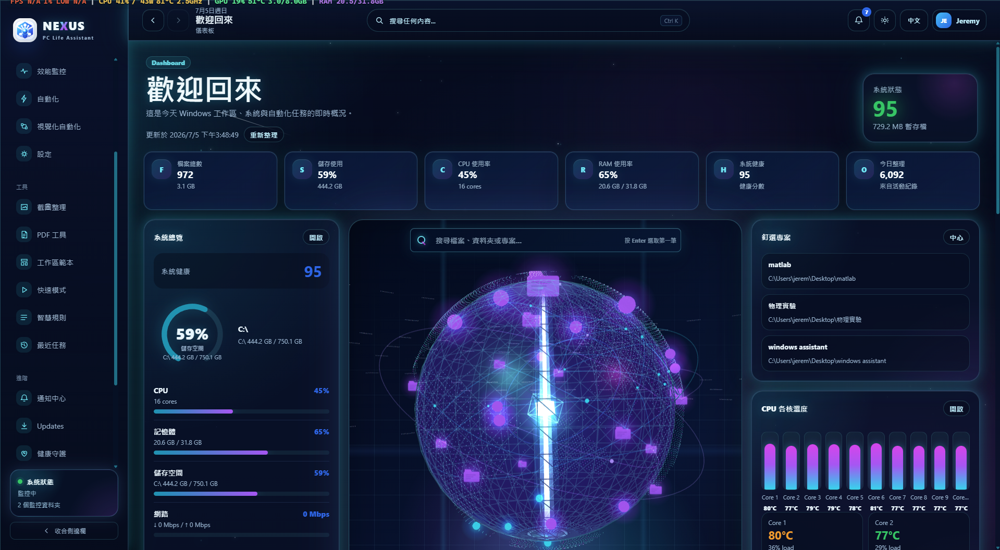
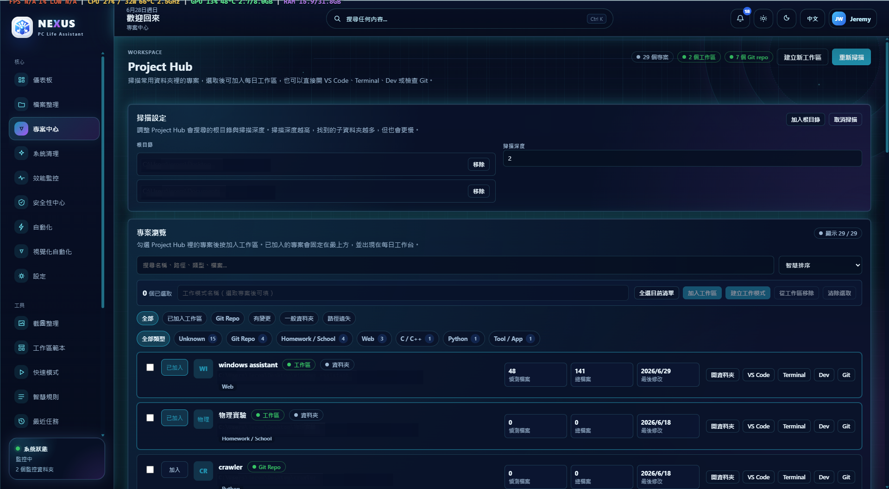
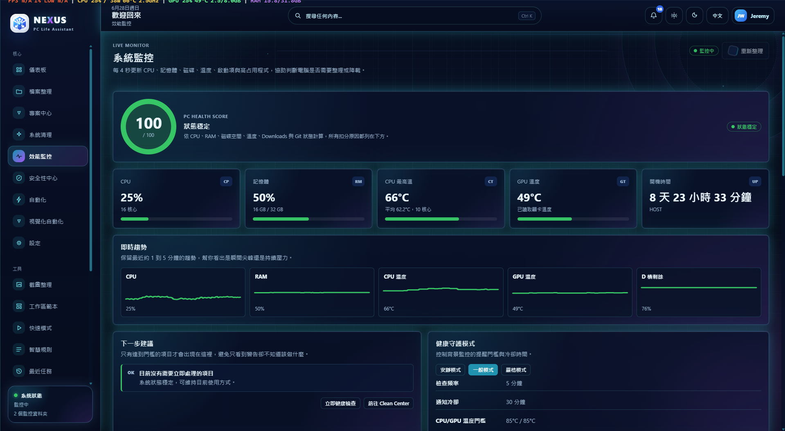
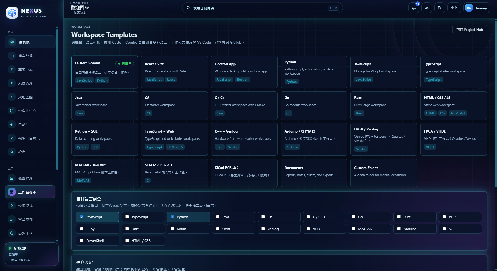
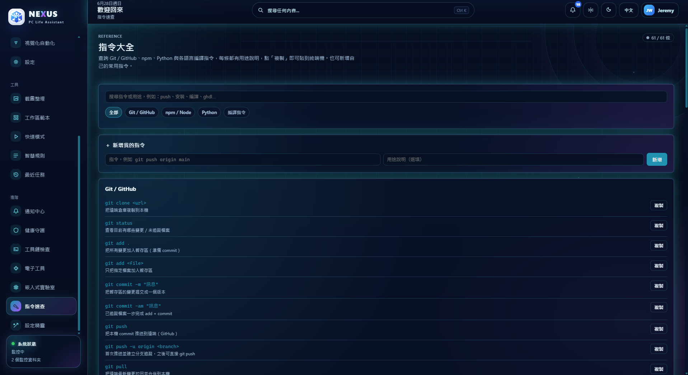
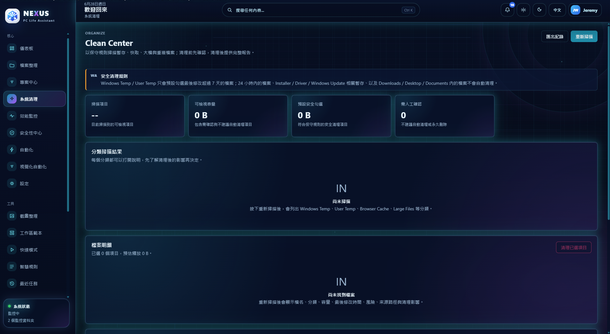
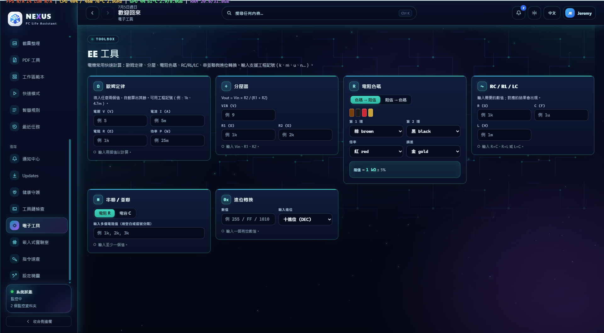
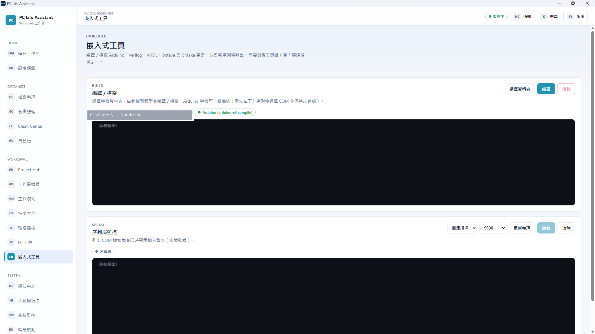

<div align="center">

# 🖥️ PC Life Assistant

**A Windows desktop workspace assistant for students, engineers, and makers.**

One place to launch projects, organize files, monitor system health, and keep daily development workflows tidy — without replacing your task manager or IDE.

[](#install-on-your-pc)
[](#)
[](#requirements)
[](https://www.electronjs.org/)
[](https://react.dev/)
[](https://vitejs.dev/)
[](#license)

</div>

<div align="center">
  
  <br/>
  <sub><b>Dashboard</b> · An interactive 3D data core that opens into categorized local files, projects, systems, cleanup, and automation nodes, surrounded by live system metrics.</sub>
</div>

---

## ✨ Overview

PC Life Assistant combines a daily workspace dashboard, project launcher, file organizer, system health monitor, automation rules, safe cleanup tools, a read-only Windows Security overview, a local PDF toolbox, and a gaming-style performance overlay into a single Electron app. The interface is branded **NEXUS** in-app and is fully **bilingual (English / 繁體中文)** with a language switch in Settings.

The goal is not to be another todo list — it's to **remove the small repeated steps** around everyday computer work: opening the same folders and tools, sorting the Downloads folder, keeping an eye on disk space and temperatures, and remembering which projects still need a Git commit.

- 🔒 **Review-first & safe by design** — file previews are read-only and bounded, file actions preview before moving, cleanup never auto-deletes, and Git features are read-only.
- 🧼 **Clean public source** — the repository ships only sanitized templates and source code, so anyone can clone it and create their own local settings on first run.
- 🧩 **No account, no cloud, no database** — every setting lives in a local JSON file.
- 🛡️ **No admin rights required** — works entirely within the folders you configure.

> The screenshots in this README are captured from the live app. The interface ships **bilingual (English / Traditional Chinese)** with an in-app language switch in Settings; the captures below show the Traditional Chinese interface, with English captions under each image.

---

## 🚀 Key Features

| Area                     | What it does                                                                                                                                                                                                                                                                       |
| ------------------------ | ---------------------------------------------------------------------------------------------------------------------------------------------------------------------------------------------------------------------------------------------------------------------------------- |
| **Dashboard**            | Interactive Three.js data core with split-glass Earth hemispheres, a central GLB data platform, categorized local file/project/system/cleanup/automation nodes, secure read-only previews, keyboard/mobile controls, health score, live system overview, and recent activity.      |
| **Project Hub**          | Scans your project roots, classifies projects by type, detects Git repos, filters and pins, and turns selected projects into a reusable Work Mode.                                                                                                                                 |
| **Work Modes**           | Opens apps, folders, URLs, and shell commands as one repeatable workspace — for coding, study, design, reports, or hardware work.                                                                                                                                                  |
| **Workspace Templates**  | Generates starter folders for Web, Python, JS/TS, C/C++, Java, Go, Rust, Arduino, FPGA (Verilog/VHDL), STM32, MATLAB, KiCad, and custom multi-language combos.                                                                                                                     |
| **Clean Center**         | Reviews temp files, caches, large files, duplicates, downloads, and recycle bin — with conservative safety rules and confirm-before-action.                                                                                                                                        |
| **Security Center**      | A read-only mirror of Windows Security status — Microsoft Defender, firewall profiles, TPM, BitLocker, and more — gathered with non-elevated PowerShell queries. It never changes security settings; it only reports them.                                                         |
| **Downloads Organizer**  | Scans Downloads, previews planned moves, classifies by rules, never overwrites, and keeps a restore option.                                                                                                                                                                        |
| **Screenshot Organizer** | Groups screenshots by date and category using configurable keyword rules.                                                                                                                                                                                                          |
| **System Monitor**       | Live CPU / RAM / disk / uptime, CPU & GPU temperatures, trend sparklines, and a tunable Health Guard.                                                                                                                                                                              |
| **Command Cheatsheet**   | A searchable reference of Git, npm, Python, and per-language build commands — one click to copy, plus your own custom entries.                                                                                                                                                     |
| **Toolchain Doctor**     | Detects whether dev/EE toolchains (Arduino CLI, Icarus Verilog, GHDL, ARM GCC, OpenOCD, CMake, Ninja, Octave, KiCad CLI, Node, Git, Python) are installed, with version, resolved PATH, and a one-click install hint.                                                              |
| **EE Quick Tools**       | Built-in calculators for electrical engineering: Ohm's law, voltage divider, bidirectional resistor colour-code (colours ⇄ value), RC/RL/LC, series/parallel, and base conversion — all engineering-notation aware.                                                                |
| **Embedded Lab**         | Detects and compiles/simulates Arduino, Verilog, VHDL, Octave, and CMake projects with streamed build output, one-click flash to an Arduino board (with confirmation), plus a read-only serial monitor (COM port list + live data).                                                |
| **Automations**          | Safe scheduled reminders and helper actions for cleanup, screenshots, and project rescans.                                                                                                                                                                                         |
| **Visual Automation**    | A node-based editor (trigger → condition → action) for building automation workflows on a drag-and-drop canvas. Reuses the same safe, review-first actions; file-mutating steps are flagged and confirmed, and a dry-run previews exactly what a workflow would do before it runs. |
| **Command Palette**      | Global quick actions (Ctrl+Shift+P / Ctrl+K) for navigation, project actions, health checks, and cleanup.                                                                                                                                                                          |
| **System Overlay**       | Optional always-on-top performance HUD (RTSS / Afterburner style) showing FPS and 1% low, CPU usage / power / temperature / clock, GPU usage / temperature / VRAM, and RAM — toggleable from the tray, with click-through.                                                         |
| **Update Center**        | Shows the current app version, checks for updates, and installs a downloaded update on restart.                                                                                                                                                                                    |
| **Setup Wizard**         | Guided first-run configuration for folders, screenshots, VS Code, project roots, and monitoring.                                                                                                                                                                                   |

---

## 📸 Screens

### Project Hub — scan, classify, and launch your projects

<div align="center">
  
  <br/>
  <sub>Scans configured roots with a depth limit, detects Git repos and project types, shows file counts and last-modified dates, and lets you open VS Code / Terminal / Dev / Git or build a Work Mode from a selection.</sub>
</div>

### System Monitor — live resource and temperature view

<div align="center">
  
  <br/>
  <sub>Updates every few seconds: health score, CPU / RAM, CPU & GPU temperatures, uptime, live trend sparklines, and Health Guard thresholds (Quiet / Normal / Strict).</sub>
</div>

### Workspace Templates — start any kind of project in seconds

<div align="center">
  
  <br/>
  <sub>Pick a single-language template or use Custom Combo to mix languages — each gets its own subfolder. New workspaces open VS Code, the folder, and GitHub by default.</sub>
</div>

### Command Cheatsheet — copy-ready commands for every workflow

<div align="center">
  
  <br/>
  <sub>Searchable Git / GitHub, npm, Python, and compiler commands, each with a short description and a one-click Copy button. Add your own frequently used commands too.</sub>
</div>

### Clean Center — conservative, review-first cleanup

<div align="center">
  
  <br/>
  <sub>Scans temp / cache / large / duplicate files under safe rules: recently modified files, installers, drivers, Windows Update, and your Downloads / Desktop / Documents are never auto-cleaned. Nothing is removed without explicit confirmation.</sub>
</div>

### EE Quick Tools — calculators, with bidirectional resistor colour code

<div align="center">
  
  <br/>
  <sub>Ohm's law, voltage divider, RC/RL/LC, series/parallel, and base conversion — all engineering-notation aware. The resistor card works both ways: colours → value, or a value → the colour bands (here 1 kΩ → brown-black-red).</sub>
</div>

### Embedded Lab — build, one-click flash, and serial monitor

<div align="center">
  
  <br/>
  <sub>Detects the project type and compiles/simulates with streamed output. Arduino projects get a one-click <b>Flash</b> button (behind a confirmation dialog), and the read-only serial monitor lists COM ports and streams live data.</sub>
</div>

---

## 🛡️ Safety Principles

PC Life Assistant is built around review-first workflows:

- File organization **previews changes before moving** files, and never deletes.
- Cleanup tools clearly separate **safe review items** from destructive actions, and require confirmation.
- Git features **inspect status and reminders only** — they never auto-commit or push.
- Project scanning works **only within folders you configure**.
- Duplicate filenames are auto-numbered instead of overwritten.
- All file operations are wrapped in error handling and recorded for review.

---

### Dashboard data core

The Dashboard globe is a local-first visualization of the same payload used by the surrounding system overview. Opening it promotes the data core into a viewport-sized workspace, separates physical/glass Earth hemispheres around a loaded GLB data platform, and distributes real nodes across deterministic three-dimensional orbital shells. The multi-depth stars, dust, nebula band, and reflections are generated locally—there are no remote runtime assets or telemetry calls.

Drag to orbit, use the wheel or pinch gesture to zoom within safe limits, select a node to focus the camera, or use Reset view. Left/Right arrows traverse visible nodes. A real folder can be opened as a spatial child cluster through **Explore contents in 3D**; breadcrumbs, Back, Escape, search, filters, the semantic directory, and the WebGL fallback all use the same normalized node model. Supported UTF-8 text/code and bounded raster images have a read-only preview; the renderer requests only an indexed node ID, and the main process revalidates canonical authorized roots before reading. Unsupported content retains metadata and a secure Explorer reveal action. Closing the core restores the original Dashboard layout and focus. See [docs/3d-assets.md](docs/3d-assets.md) for the reproducible GLB/Blender asset workflow.

The scene intentionally omits unavailable telemetry. Counts, capacities, paths, statuses, timestamps, and connection totals are only shown when derived from the dashboard service response; unavailable values are labeled accordingly.

---

## 🧱 Architecture

```text
pc-life-assistant/
  electron/                 # Main process
    main.js                 #   Window, tray, and IPC handlers
    preload.js              #   Secure renderer bridge (window.api)
    services/               #   System, project, cleanup, settings, automation & overlay services
  src/                      # React renderer
    App.jsx                 #   App routing and layout composition
    main.jsx                #   React entry point
    i18n.jsx                #   Bilingual (en / zh) string resources and provider
    overlay/                #   Transparent always-on-top performance HUD
    services/               #   Renderer-side data helpers
    pages/                  #   Main app screens
    components/             #   Reusable UI components (incl. dashboard widgets)
      dashboard/
        DashboardGlobe.jsx   # Three.js globe scene and interaction state
        GlobeNodePanel.jsx   # Accessible directory, search, and node details
        globeLayout.js        # Pure node adapter, relationships, and layout
        useDashboardNodeExplorer.js # Real folder scopes, breadcrumbs, and scene sync
        globe-scene/          # Space environment, camera controller, and GLB loader
    layout/                 #   App shell, sidebar, topbar
    theme/                  #   Theme provider
    styles/                 #   Global styles and design tokens
    utils/                  #   Formatting helpers
  config/
    user-settings.example.json  # Sanitized settings template (the real, git-ignored
                                #   user-settings.json is created from it at runtime)
  scripts/
    clean-dist.js           # Build cleanup helper
    generate-icons.js       # Icon generation helper
  package.json
  vite.config.mjs
```

**Tech stack:** Electron 42 · React 18 · Vite 6 · Node.js · primarily JavaScript · Three.js for the dashboard globe · bilingual i18n (en / zh) · packaged with electron-builder (NSIS installer).

---

## 🗂️ Main Screens

| Screen              | Purpose                                                                                                               |
| ------------------- | --------------------------------------------------------------------------------------------------------------------- |
| Dashboard           | Open a 3D data core, browse categorized local nodes, and review quick actions, pinned projects, and system health.    |
| Project Hub         | Project scanning, search, filters, Git state, pinning, and Work Mode creation.                                        |
| Work Modes          | Create, edit, duplicate, and launch repeatable workspaces.                                                            |
| Workspace Templates | Generate starter folder structures for common project types.                                                          |
| File Organizer      | Preview and organize downloads or a selected folder.                                                                  |
| Screenshots         | Scan and organize screenshot images by date and category.                                                             |
| Clean Center        | Review cleanup candidates and safe maintenance suggestions.                                                           |
| Security Center     | Read-only Windows Security overview: Defender, firewall, TPM, BitLocker, and related status.                          |
| Automations         | Configure scheduled reminders and safe helper actions.                                                                |
| System Monitor      | Inspect live hardware and resource status.                                                                            |
| Health Monitor      | Review health checks, recommendations, and guard settings.                                                            |
| Command Cheatsheet  | Copy-ready Git / npm / Python / build commands.                                                                       |
| Toolchain Doctor    | Detect installed dev/EE toolchains, versions, and PATH, with install hints.                                           |
| EE Quick Tools      | Electrical-engineering calculators (Ohm's law, dividers, bidirectional resistor colour code, RC/LC, base conversion). |
| Embedded Lab        | Compile/simulate Arduino/Verilog/VHDL/Octave/CMake projects, one-click flash to Arduino, and monitor a serial port.   |
| Notification Center | Review app notifications and related actions.                                                                         |
| Update Center       | Check the current version and install app updates.                                                                    |
| Activity History    | Review recent organize, cleanup, and notification activity.                                                           |
| Settings            | Manage paths, appearance, health guard, cleanup behavior, and preferences.                                            |
| Setup Wizard        | Guided first-run setup for important folders and tools.                                                               |
| System Overlay      | Always-on-top FPS / CPU / GPU / RAM performance HUD.                                                                  |

---

## 📦 Requirements

- Windows 10 or later (Windows 11 recommended).
- Node.js 18 or later.
- npm.
- Git, if you want to clone the source code instead of downloading a ZIP.
- VS Code is optional but recommended for project launching features.
- Optional, for the System Overlay only: Intel PresentMon or NVIDIA FrameView for the in-game FPS counter, and an NVIDIA GPU with `nvidia-smi` for GPU usage / VRAM. The overlay degrades gracefully and shows "N/A" when these are unavailable.

---

## Install On Your PC

There are two ways to use PC Life Assistant locally.

### Latest release

Version **2.5.8** ships the cinematic Dashboard data core: a fullscreen 3D globe workspace with split Earth hemispheres, real local folder/file nodes, secure read-only previews, reproducible GLB assets, and hardened Electron IPC for indexed node browsing.

### Option A: Install the packaged app

1. Go to this repository's **Releases** page, if a release installer has been attached.
2. Download `PC-Life-Assistant-Setup-2.5.8.exe`.
3. Run the installer.
4. Launch **PC Life Assistant** from the Start menu or desktop shortcut.

The installer is per-user by default. On first launch, the app creates fresh local settings under your own Windows account:

```text
%APPDATA%\PC Life Assistant\user-settings.json
```

No developer machine paths, project folders, history, or private settings are bundled into the installer.

### Option B: Clone and run from source

Open PowerShell and run:

```powershell
git clone https://github.com/Tse1234321/windows-assistant.git
cd windows-assistant
npm ci
npm run dev
```

This starts Vite and Electron together. The app creates a local development settings file at:

```text
config/user-settings.json
```

That file is git-ignored because it contains your own folders and preferences.

### Build your own installer

From the cloned repository:

```powershell
npm ci
npm run format:check
npm run lint
npm run typecheck
npm test
npm run build
npm run package
```

The generated installer is written to:

```text
release-auto\PC-Life-Assistant-Setup-2.5.8.exe
```

Build outputs such as `dist/`, `release-auto/`, `node_modules/`, generated icons, logs, and real settings files are intentionally ignored by Git.

---

## 🛠️ Development

```bash
# Install exact dependencies from package-lock.json
npm ci

# Run the desktop app in development (Vite + Electron)
npm run dev

# Build the React renderer
npm run build

# Create a Windows installer (NSIS .exe)
npm run package

# Create an unpacked build for local inspection
npm run package:dir
```

### Scripts

| Script                   | Purpose                                                          |
| ------------------------ | ---------------------------------------------------------------- |
| `npm run dev`            | Starts Vite and Electron for local development.                  |
| `npm run dev:vite`       | Starts only the Vite dev server.                                 |
| `npm run dev:electron`   | Starts only Electron after the renderer is available.            |
| `npm run build`          | Builds the React renderer.                                       |
| `npm run preview`        | Previews the built renderer.                                     |
| `npm run gen:icons`      | Generates app icon assets.                                       |
| `npm run package`        | Builds and packages the Windows installer.                       |
| `npm run package:dir`    | Builds an unpacked Windows app directory.                        |
| `npm run package:signed` | Requires trusted signing credentials and fails closed otherwise. |
| `npm run perf:packaged`  | Runs the explicit packaged-app performance probe.                |
| `npm run release:github` | Maintainer release helper after publish settings are configured. |
| `npm run lint`           | Runs ESLint.                                                     |
| `npm run typecheck`      | Type-checks with `tsc --noEmit`.                                 |
| `npm run test`           | Runs the Vitest unit suite.                                      |
| `npm run format`         | Formats the codebase with Prettier.                              |

### Quality & contributing

The project ships with ESLint + Prettier, a Vitest unit suite, strict TypeScript checking, and a GitHub Actions CI pipeline. The expected local gate is:

```bash
npm run format:check
npm run lint
npm run typecheck
npm test
npm run build
```

See **[ARCHITECTURE.md](./ARCHITECTURE.md)** for how the main process, preload bridge, and renderer fit together, and **[CONTRIBUTING.md](./CONTRIBUTING.md)** for setup, quality gates, and patterns for adding a backend capability or workflow node type.

---

## ⚙️ Configuration

The app stores preferences in a local JSON settings file:

- monitored folders and project roots;
- work modes and workspace templates;
- screenshot organization rules;
- cleanup behavior and health-guard thresholds;
- theme and compact mode;
- notification and automation preferences.

The repository ships a sanitized template, `config/user-settings.example.json`. On first run the app creates its own settings file from that template — `config/user-settings.json` in development and `%APPDATA%\PC Life Assistant\user-settings.json` in a packaged build.

Both locations are local to the person running the app. Real paths, personal project roots, runtime history, logs, generated installers, dependency folders, and private endpoints should never be committed.

---

## 🔐 Privacy & Local Data

PC Life Assistant is a **local desktop utility**. Its features operate on local folders and local system information that you select or configure. Nothing is sent to a server.

Public documentation and commits should not include personal machine paths, private project names, credentials, private endpoints, generated installers, dependency folders, or logs/backups.

---

## 🗺️ Roadmap Ideas

- More built-in workspace templates.
- Richer health-score history charts.
- More project language detectors.
- Improved restore history for all file operations.
- More automation triggers with explicit review controls.
- Optional export/import for settings.

---

## 📄 License

[MIT](LICENSE)
